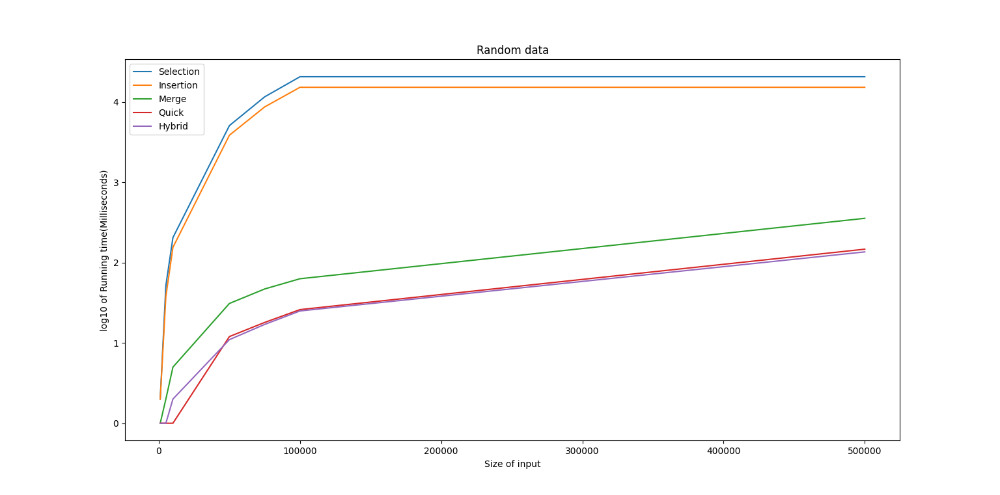
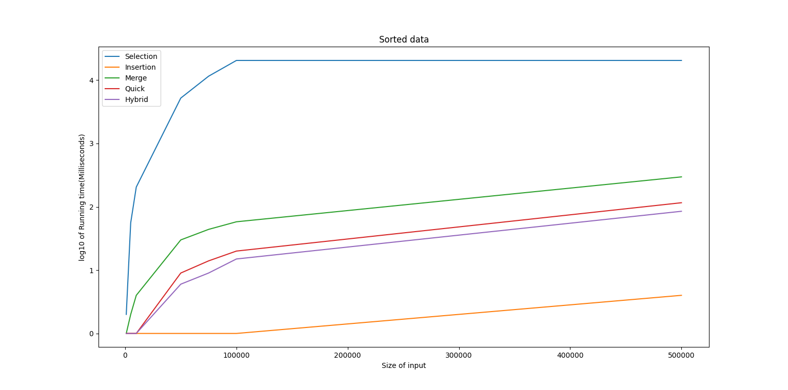

# Sorting-Comparison

In this assignment, it is required to implement some sorting algorithms, evaluate the performance of these algorithms and test their performance on large datasets. For this task, I will use C++ to implement the sorting algorithms. After that, I will test my code using randomly generated large datasets.

## Random data running time

Algorithm\data size   |1000 | 5000 | 10000 | 50000 | 75000 | 100000 | 500000
----- | ----- | ----- | ------ | ----- | ------ | -----| ----  
Selection |	2 |	52 | 205 | 5086 | 11608 | 20650 | -
Insertion| 2 | 38| 155| 3859| 8694 | 15256| -
Merge    | 0 | 2 | 5  | 31  | 47   | 63   | 356
Quick    | 0 | 0 | 1  | 12  | 20   | 26   | 147
Hybrid   | 0 | 0 | 2  | 11  | 17   | 25   | 136

## Sorted data running time

Algorithm\data size |1000 |5000   |10000   |50000   |75000  |100000 |500000
----- | ----- | ----- | ------ | ----- | ------ | -----| ----  
Selection	|2    |56     |205     |5215    |11549  |20485  |-
Insertion	|0    |0      |0       |0       | 0     |0      |4
Merge	    |0    |2      |4       |30      | 44    |58     |297
Quick	    |0    |0      |1       |9       | 14    |19     |116
Hybrid	    |0    |0      |1       |6       | 9     |15     |85

## Random data graph

## Sorted data graph

## how is hybrid sorting algorithm created?

From the running time of all algorithms, I found that randomized quick sort is the best sorting algorithm at all values of N except for insertion sort in sorted data and some other sorting algorithms has the same running time as that of randomized quick sort at some values of N.

But zero time at some values of N doesn’t give me an indicator to which of them is better at this value of N so I calculated the time in microseconds and, I found that randomized quick sort is the best also except for insertion sort in sorted data.

So, I concluded that I must use randomized quick sort at all values of N except for sorted data I have to use insertion sort.

So, I designed the hybrid algorithm as follows: -

1- Use randomized quick sort

2- When size of partition is less than or equal to 20 elements switch to insertion

This approach may give better performance if the data in the partition is sorted or almost sorted.